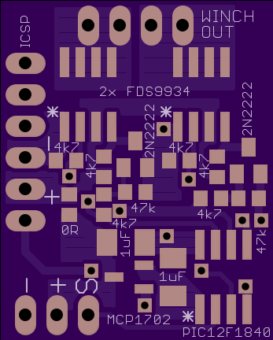
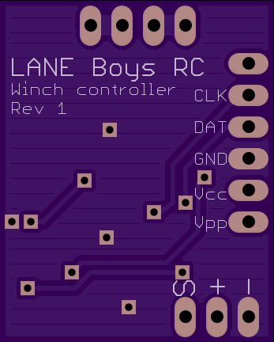

DIY controller an RC car winch
==============================

This project is for a winch controller for Radio Controlled cars that uses
channel 3 to operate the winch remotely.

Usage
=====

Connect the winch controller to channel 3 of your receiver.

Three seconds after you apply power to the controller the winch motor will play
a short tune. The sound will only play if a valid input signal has been
detected. Note that the sound generated by the motor may be very faint depending on your
winch.

To arm the switch, change the position of the channel 3 switch on your
transmitter five times within a short period of times. The winch motor
will now play a different tune of rising sounds indicatiting that it is
armed. While armed, the winch motor will be braked electrically.

To move the winch in one direction, change the position of the channel 3
switch once. To move the winch in the other direction, change the position
of the channel 3 switch twice within a short time.

To stop the winch moving toggle the position of the channel 3 switch.

Hardware
========

The winch hardware is basically a H-bridge motor driver controlled from a
tiny microcontroller.

The winch controller can be powered via the RC receiver, or from a separate
supply connected to the pins labeled + an - on the ICSP connector.

The main components are a Microchip PIC 12F1840 microcontroller, two
dual N- and P-Channel power FETs Fairchild FDS9934C, and a 3.3V LDO
(Microchip MCP1702, 1703 or similar).

A common 1/10th scale RC winch can lift about 1.5 kg at 6 Volts. The maxium
current we measured on our winch is 800 mA.

The schematics and a PCB layout are available in the `electronics <electronics/>`_ folder.

Bill of material:

::

    Qty Value            Device               Parts
    1   PIC12F1840       PIC12F1840 S08       U$2
    2   FDS9934          P/N MOSFET SO8       T1, T2
    1   MCP1702-3302     LDO 3V3 SOT23        U$1
    2   MMTB2222         NPN-TRANSISTOR SOT23 Q1, Q2
    2   1uF/16V          Capacitor SMD 1206   C1, C2
    1   0R               Resistor SMD 0603    R9 (can be replced with a solder bridge)
    6   4k7              Resistor SMD 0603    R1, R2, R3, R4, R7, R8
    2   47k              Resistor SMD 0603    R5, R6

The 2-layer PCB size is 22.05 x 27.43 mm (0.87 x 1.08 inches).

Gerber files for the PCB can be found in the `electronics <electronics/>`_ folder. The PCB can be
`ordered directly from OSHPark <http://www.oshpark.com>`_ in a minimum quantity of three.

Software
========

The firmware has been developed using SDCC version 3.3 and gpasm version 1.0.
GNU make is required for the build.

If you are compiling the software on a computer that does not have Unix-like
tools installed (e.g. Microsoft Windows) then you may need to adapt the
rm utility referenced in the Makefile (i.e. use "del" instead of "rm").

For convenience a pre-compiled HEX file is available for download `here <firmware/rc-winch-controller-servo.hex>`_.

The firmware comes in two variants: One that connects to channel 3 of a
RC receiver, and one with UART input which is meant to be utilized in
conjunction with the `LANE Boys RC DIY RC Light controller <http://laneboysrc.blogspot.com/2012/07/diy-car-light-controller-for-3-channel.html>`_.

